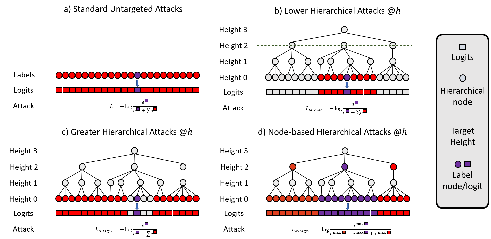

# Official Repository: A Hierarchical Assessment on Adversarial Severity

This is the official repository for the paper **A Hierarchical Assessment on Adversarial Severity**

Coming soon. We are creating the official github page so you can run it without any problem.




-- ## Setting up the environment

First, install the environment via anaconda by following:
```bash
conda env create -f environment.yml
conda activate AdvSeverity
```

Then, install AutoAttack and tqdm by running:
```bash
pip install git+https://github.com/fra31/auto-attack
pip install tqdm
```

## Data preparation

 * Download train+val sets of [iNaturalist'19](https://www.kaggle.com/c/inaturalist-2019-fgvc6)
 * Unzip the zip file `dataset_splits/splits_inat19.py`
 * Create the dataset by running the `generate_splits.py` script. Change the `DATA_PATH` AND `OUTPUT_DIR` variables to fit your specifications.
 * Resize all the images into the 224x224 format by using the `resize_images.sh` script: `bash ./resize_images.sh new_splits_backup new_splits_downsampled 224x224!`
 * Rename `data_paths.yml` and edit it to reflect the paths on your system. 


# Training and Evaluation

## Training

To run the training rutine, run the `main.py` script.


## Evaluation

The experiments of the papers are contained in the `experiments/` directory. Inside of your environment (or docker) run for example:
```
cd experiments
bash crossentropy_inaturalist19.sh
```

The entry points for the code are all inside of `scripts/`:
* `start_training.py` runs training and validation for all the methods (note: the code has been tested on single-gpu mode only)
* `plot_tradeoffs.py` produces the main plots of the paper given the json files produced by `start_training.py`
* `start_testing.py` runs the trained model on the test set for the epochs output by `plot_tradeoffs.py` (as in `experiment_to_best_epoch.json`).

This code was based on Bertinetto's *Making Better Mistakes* [official repository](https://github.com/fiveai/making-better-mistakes)

## License

This work is licensed under a [Creative Commons Attribution-NonCommercial-ShareAlike 4.0 International License](https://creativecommons.org/licenses/by-nc-sa/4.0/).
Commercial licenses available upon request.

